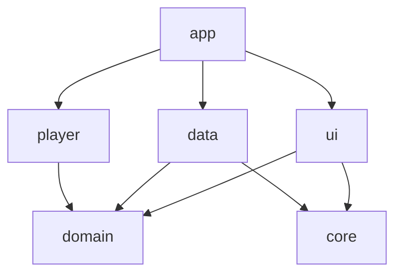

# 🎵 Pulse

<div align="center">


**一款現代化的 Android 本地音樂播放器，採用 Material Design 3 設計語言**

[功能特點](#-功能特點) • [截圖](#-截圖) • [技術架構](#-技術架構) • [安裝](#-安裝) • [貢獻](#-貢獻)

</div>

---

## ✨ 功能特點

### 🎨 設計與體驗
- **Material Design 3** - 採用最新的 Material You 動態主題
- **動態調色盤** - 根據專輯封面自動生成漸層背景
- **流暢動畫** - 優化的動畫過渡，帶來絲滑的操作體驗
- **深色模式** - 完整支援系統深色/淺色主題
- **響應式佈局** - 適配各種螢幕尺寸

### 🎵 播放功能
- **完整播放控制** - 播放、暫停、上一首、下一首
- **隨機播放 & 重複模式** - 支援單曲循環、列表循環
- **交叉淡入淡出** - 歌曲間無縫過渡，支援多種曲線與時長調整
- **進度控制** - 精準的進度條拖動與時間顯示
- **波形可視化** - 專業級的波形進度條
- **歌詞同步** - 即時歌詞顯示與點擊跳轉
- **睡眠計時器** - 自動停止播放

### 📚 音樂庫管理
- **本地音樂掃描** - 自動掃描裝置中的音樂檔案
- **多種分類** - 歌曲、專輯、藝人分類瀏覽
- **智慧搜尋** - 快速搜尋歌曲、專輯、藝人
- **播放列表** - 建立與管理自訂播放清單
- **收藏功能** - 一鍵收藏喜愛的歌曲
- **最近播放** - 快速存取最近添加的音樂

### 📱 系統整合
- **小工具 (Widget)** - 桌面音樂控制小工具
- **媒體通知** - 鎖屏與通知列播放控制
- **媒體按鍵** - 支援耳機與藍牙按鍵控制
- **Android Auto** - 車載系統整合 (計畫中)

---

## 📸 截圖

| 主畫面 | 正在播放 | 歌詞顯示 |
|:---:|:---:|:---:|
| 歌曲列表與快速操作 | 動態背景與播放控制 | 同步歌詞與點擊跳轉 |

| 專輯瀏覽 | 播放清單 | 設定 |
|:---:|:---:|:---:|
| 專輯封面網格 | 自訂播放清單管理 | 主題與播放設定 |

---

## 🏗 技術架構

本專案採用 **Clean Architecture** 與 **模組化設計**，確保程式碼的可維護性與可測試性。

### 模組結構

```
pulse/
├── app/                 # 應用程式入口與 DI 設定
├── core/
│   ├── common/          # 共用工具與擴展函數
│   └── designsystem/    # 設計系統元件
├── data/                # 資料層實作
│   ├── database/        # Room 資料庫
│   ├── datasource/      # 本地資料來源
│   └── repository/      # Repository 實作
├── domain/              # 業務邏輯層 (Pure Kotlin)
│   ├── model/           # 領域模型
│   ├── repository/      # Repository 介面
│   └── usecase/         # 業務用例
├── player/              # 播放器模組
│   ├── controller/      # 播放控制器
│   └── service/         # 媒體服務
└── ui/                  # UI 層 (Jetpack Compose)
    ├── home/            # 主畫面
    ├── nowplaying/      # 正在播放
    ├── albums/          # 專輯列表
    ├── playlist/        # 播放清單
    └── settings/        # 設定
```

### 依賴關係



### 技術棧

| 類別 | 技術 |
|-----|-----|
| **語言** | Kotlin 2.0.21 |
| **UI 框架** | Jetpack Compose + Material 3 |
| **架構模式** | MVVM + Clean Architecture |
| **依賴注入** | Hilt |
| **資料庫** | Room |
| **媒體播放** | Media3 (ExoPlayer) |
| **圖片載入** | Coil |
| **非同步處理** | Kotlin Coroutines + Flow |
| **建構工具** | Gradle Kotlin DSL |

---

## 📥 安裝

### 系統需求
- Android 8.0 (API 26) 或更高版本
- 建議 Android 12+ 以獲得最佳動態主題體驗

### 從原始碼建構

```bash
# 1. 複製專案
git clone https://github.com/bennytsai1234/pulse.git
cd pulse

# 2. 建構 Debug APK
./gradlew assembleDebug

# 3. 安裝到連接的裝置
./gradlew installDebug
```

### 從 Release 下載
前往 [Releases](https://github.com/bennytsai1234/pulse/releases) 頁面下載最新版本 APK。

---

## 🧪 測試

專案包含完整的測試套件：

```bash
# 執行所有單元測試
./gradlew test

# 執行 Android 儀器測試
./gradlew connectedAndroidTest

# 執行 Lint 檢查
./gradlew :app:lintDebug
```

### 測試覆蓋範圍
- ✅ Domain Layer UseCases 單元測試
- ✅ Data Layer Repository 整合測試
- ✅ UI Layer ViewModel 單元測試
- ✅ Room Database DAO 測試

---

## 🤝 貢獻

歡迎各種形式的貢獻！

1. Fork 這個專案
2. 建立你的功能分支 (`git checkout -b feature/AmazingFeature`)
3. 提交你的變更 (`git commit -m 'Add some AmazingFeature'`)
4. 推送到分支 (`git push origin feature/AmazingFeature`)
5. 開啟一個 Pull Request

### 程式碼規範
- 遵循 [Kotlin 官方程式碼規範](https://kotlinlang.org/docs/coding-conventions.html)
- 使用 [Conventional Commits](https://www.conventionalcommits.org/) 格式撰寫提交訊息
- 確保所有測試通過後再提交 PR

---

## 📄 授權

本專案採用 MIT 授權條款 - 詳見 [LICENSE](LICENSE) 檔案。

---

## 🙏 致謝

- [Jetpack Compose](https://developer.android.com/jetpack/compose) - 現代 Android UI 工具
- [Media3](https://github.com/androidx/media) - 強大的媒體播放框架
- [Material Design 3](https://m3.material.io/) - 設計語言指南
- [Kotlin](https://kotlinlang.org/) - 優雅的程式語言

---

<div align="center">

**Made with ❤️ by Pulse Team**

[⬆ 回到頂端](#-pulse)

</div>
